# Travel Order Resolver

**Group Members :** [Antoine AZAR](https://github.com/Az-r-ow), [Paul DUQUESNOY](https://github.com/DuquesnoyPaul), [Lucas CHAPUIS](https://github.com/lucas066001), [Matthias GOUPIL](https://github.com/matthias-goupil), [Cao Thanh Uy NGUYEN](https://github.com/uy-nguyen00)

**Subjects :** NLP, NER, Shortest-path, Audio2Text

---

## Introduction

The goal of the project was to get some hands on learning about NLP in the context of travel. We were asked to submit an interface that takes in audio or text input and using a pre-trained model classify this text (known as named entity recognition or NER) to extract the destination and arrival locations. Then using these locations and a database of train stations in France find the shortest path between them. In this report, we will go over the four main parts of the project: **Audio2Text**, **Token Classification**, **Shortest Path Algorithm** and the **Interface**.

You might notice that the **Token Classification** part is the most developed this is because it was the core of the project and the most challenging part. The other parts were more or less straightforward. In addition, it's important to note that the work was done in a group and each member contributed to the project in different ways.

## Audio2Text

As mentioned previously, the first step of the project was to convert the audio input to text. We used a Huggingface `"automatic-speech-recognition"` pipeline with the `openai/whisper-base`[[1]](#1)model.

```python
from transformers import pipeline

transcriber = pipeline(
    "automatic-speech-recognition", model="openai/whisper-base", device="cpu"
)

def transcribe(audio):
    """
    Transcribe audio into text
    """
    sr, y = audio

    # Convert to mono if stereo
    if y.ndim > 1:
        y = y.mean(axis=1)

    y = y.astype(np.float32)
    y /= np.max(np.abs(y))

    return transcriber({"sampling_rate": sr, "raw": y})["text"]
```

This allowed us to transcribe the audio input into text. The next step was to classify the text into tokens.

## Token Classification (NER)

### 1 - Data Acquisition

#### 1.1 - Data generation

Since the purpose of the project was to extract the destination and arrival locations from French text, we needed a dataset that had the following requirements :

- French text
- Destination and arrival locations labeled as such
- Anything outside of that was not labeled (or it could have been labeled)
- Sentences that revolved around travel by train

We did not find a dataset that met all these requirements so we decided to create our own. To avoid having to write thousands of sentences by hand, we used **ChatGPT** and **Gemini** - _because of it's increased token limit_ - to generate the them for us.

**Prompt example to Gemini-1.5-flash**

```text
I'm working on a Named Entity Recognition project in which I have to train a model to recognize the departure and arrival location from a sentence. For example in the phrase :
Je veux aller de Paris à Montpellier

The model must be able to recognize the departure which is 'Paris' and the arrival 'Montpellier'. For that you're going to generate a tagged dataset in French while following the given requirements :
- You must wrap the departure and arrival with tags like the following example :
Je veux aller depuis <Dep>Paris<Dep> vers <Arr>strasbourg<Arr>
- You must use a placeholder instead of actual city names
- You must change the sentence structures for each data point
- Each sentence will represent a data point
- Each sentence should be a new line
- You must generate an output in txt format
- You must vary the complexity of the sentences
- You must vary the order of the occurrence of the arrival and departure location
- You must not repeat the sentences (get creative !)
```

**Output example**

```text
Je voudrais voyager de <Dep>{depart}<Dep> à <Arr>{arrivee}<Arr>.
Quel est le trajet le plus rapide depuis <Dep>{depart}<Dep> jusqu'à <Arr>{arrivee}<Arr> ?
Je cherche un billet d'avion pour aller de <Dep>{depart}<Dep> vers <Arr>{arrivee}<Arr>.
Pouvez-vous me donner des informations sur un vol de <Dep>{depart}<Dep> à <Arr>{arrivee}<Arr> ?
Je veux aller de <Arr>{arrivee}<Arr> à <Dep>{depart}<Dep>.
... 215 more lines
```

More on data generation can be found in the `data` folder where we labeled the sub-folders names with the name of the LLM used as well as the initials of the person who wrote the prompt.

#### 1.2 - Placeholder replacement

We purposely asked the model to generate the sentences with a placeholder instead of an actual city name so we could - with the help of a script - replace the placeholders with actual French city names from our dataset. This opened the door to a lot of possibilities of departure and arrival cities modalities.

This script is located in the `data/scripting_lcs_1` folder and can be used as follows :

```bash
python script.py <input_file> <output_file> <nb_samples>
```

Where `input_file` is the file generated by the LLM, `output_file` is the file where the placeholders will be replaced by actual city names and `nb_samples` is the number of samples to generate.

#### 1.3 - BIO Format

The data was then converted to the BIO format which is a common format used in NER tasks in order to make it open source and usable to whomever wants to use it.

#### 1.4 - Data Split

The data is composed of 10 000 sentences :

- 8000 Sort samples with arrival and departure entities in the same sentence.
- 1000 Lambda sentences (without entities)
- 1000 Long samples with arrival and departure entities in separate sentences or far from each other.

A 80/20 split was done to create the training and testing datasets.

> The lambda sentences were selected from the [OpusNLP](https://opus.nlpl.eu/results/fr&fr/corpus-result-table) french dataset.

### 2 - Sentence Preprocessing

#### 2.1 - Tokenization and sentence alteration methods

We wrote a function that does all the preprocessing steps needed to adjust the sentences and labels before encoding them. This function is located in :
`app/travel_resolver/libs/nlp/ner/data_processing.py`

```python
def process_sentence(
    sentence: str,
    rm_stopwords: bool = False,
    stemming: bool = False,
    return_tokens: bool = False,
    labels_to_adapt: list[int | str] | None = None,
    stopwords_to_keep: list[str] = [],
) -> str | tuple[list[str], list[int]] | tuple[list[str], list[str]]
```

This function takes in a sentence and returns a processed sentence. It can also return the tokens and labels if needed. The function has the following parameters :

- `sentence` : The sentence to process
- `rm_stopwords` : Whether to remove stopwords or not
- `stemming` : Whether to stem the words or not
- `return_tokens` : Whether to return the tokens or not (split the sentence into words)
- `labels_to_adapt` : The labels to adapt (in case of stopwords removal it removes the labels of the stopwords)
- `stopwords_to_keep` : The stopwords to keep (to bypass the default stopwords provided by `nltk`)

#### 2.2 - Vocabulary

The vocabulary is extracted while loading the dataset and is returned as a set to avoid duplicates. This vocabulary is used to encode the sentences.

#### 2.3 - Encoding and padding

The aforementioned vocabulary is used to encode the sentences. The sentences and labels are also padded to the maximum length of the dataset which is rounded to 100.

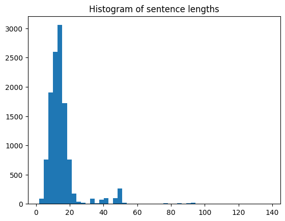

#### 2.4 - POS as extra features

We also experimented with adding the POS tags as extra features to the model. This was done by using the [`stanza`](https://stanfordnlp.github.io/stanza/) library by [Stanford NLP Group](https://nlp.stanford.edu/) to get the POS tags of each word in the sentence and then encoding them.

```python
import stanza

# Creating the french pipeline for POS tagging
nlp = stanza.Pipeline(
    "fr", processors="tokenize,pos", use_gpu=True, pos_batch_size=3000
)

# Function to batch process the sentences
def get_sentences_pos_tags(sentences: list[str]):
    """
    Get the POS tags of the words in the sentences.

    Args:
    sentences (list): List of sentences to get the POS tags from.

    Returns:
    pos_tags (list): List of POS tags for each sentence.
    """
    docs = [stanza.Document([], text=sentence) for sentence in sentences]
    pos_tags_docs = nlp(docs)

    sentences_pos_tags = []
    for doc in pos_tags_docs:
        sentences_pos_tags.append([word.upos for word in doc.sentences[0].words])

    return sentences_pos_tags
```

### 3 - Metrics and Evaluation

To ensure a fair evaluation between models, we use an evaluation dataset of **1000** sentences composed with the same ration of sentence types as the [training dataset](#14---data-split). In addition, these sentences and their structures are unseen during training.

The evaluation is done using the **F1-score** over 30 bootstraps.

### 4 - Models

In this section we will go over the models we used to classify the tokens. Here's a recap table of the models we used as well as their preprocessing steps :

| model_name | lowercasing | stemming | POS | stopwords_removal |
| ---------- | ----------- | -------- | --- | ----------------- |
| HMM        | x           | x        |     | x                 |
| LSTM       | x           | x        | x   |                   |
| BiLSTM     | x           | x        |     |                   |
| CamemBERT  |             |          |     |                   |

#### 4.1 - Hidden Markov Model (HMM)

##### 4.1.1 - Overview

_The code for the HMM model can be found in `hmm_ner.ipynb`_

HMM's are the simplest form of probabilistic models. They are used to model sequences of observations. In addition, they're important to understand because they are the basis of more complex models like CRF's[[2]](#2).

We manually calculated the **transition** and **emission** probabilities and used them to predict the labels of the tokens. The results were not very good but it was a good exercise to understand the basics of probabilistic models.

##### 4.1.2 - Model

In our case, the **hidden states** were the labels and the **observations** were the tokens. So the transition probabilities are :

$P(H_t | H_{t - 1})$

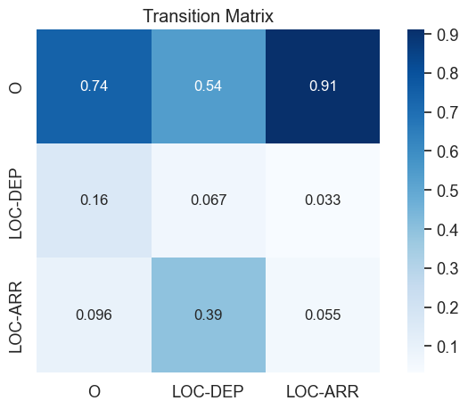

**Emission probabilities**

|              | O        | LOC-DEP  | LOC-ARR  |
| ------------ | -------- | -------- | -------- |
| &lt;UNK&gt;  | 0.000356 | 0.778291 | 0.777518 |
| je           | 0.083378 | 0.000000 | 0.000000 |
| voudr        | 0.042667 | 0.000000 | 0.000000 |
| trouv        | 0.042667 | 0.000000 | 0.000000 |
| vol          | 0.037511 | 0.000000 | 0.000000 |
| ver          | 0.042844 | 0.000000 | 0.000000 |
| compagn      | 0.028800 | 0.000000 | 0.000000 |
| aérien       | 0.028800 | 0.000000 | 0.000000 |
| d'hélicopter | 0.000889 | 0.000000 | 0.000000 |
| ...          | ...      | ...      | ...      |
| .            | 0.113600 | 0.000000 | 0.000000 |

**Start Probabilities**

|         | Start Probability |
| ------- | ----------------- |
| O       | 1.0               |
| LOC-DEP | 0.0               |
| LOC-ARR | 0.0               |

##### 4.1.3 - Results

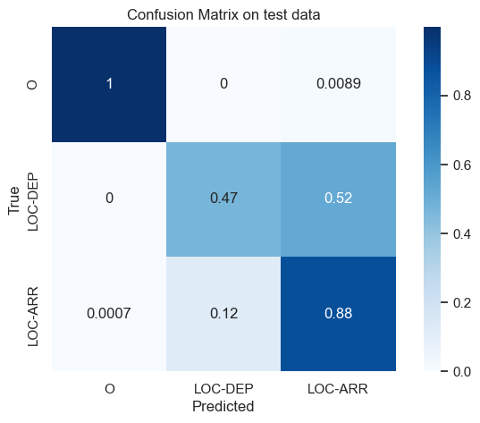

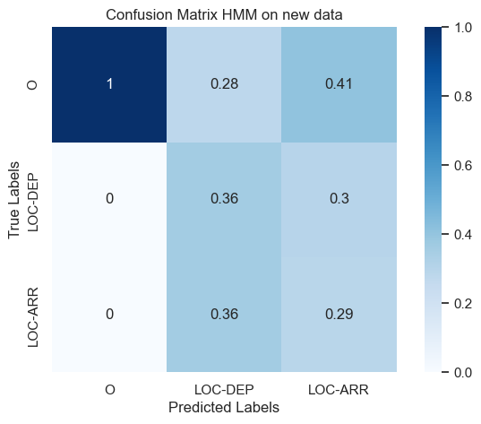

#### 4.2 - LSTM

##### 4.2.1 - Overview

> **It's imporant to note that for this model and the rest we used [Tensorflow](https://www.tensorflow.org/)**

_The code for the LSTM model can be found in `deepl_ner.ipynb`_

LSTM's[[3]](#3) are a type of RNN that are able to learn long-term dependencies. They are used in many NLP tasks because of their ability to remember information for long periods of time.

Inspired by _Simeonova et al. (2019)_[[4]](#4), we tried combining the embeddings with the POS tags as features to see if it would improve the model's performance. However, because of time constraints we were not able to include the CRF layer. Regardless, the model performed well with the POS.

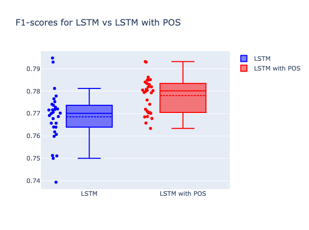

##### 4.2.2 - Architecture

<div>
    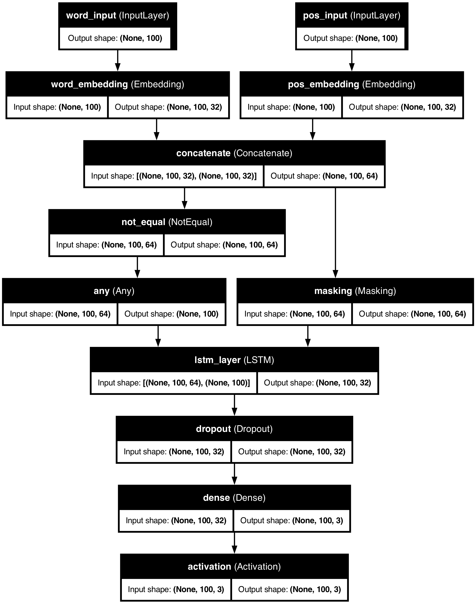
</div>

##### 4.2.3 - Training

```python
lstm_with_pos.compile(
    optimizer=tf.keras.optimizers.Adam(0.01),
    loss=masked_loss,
    metrics=[entity_accuracy],
)

lstm_with_pos.fit(
    pos_train_dataset.batch(32),
    validation_data=pos_test_dataset.batch(32),
    epochs=10,
    callbacks=[
        tf.keras.callbacks.EarlyStopping(
            monitor="val_loss", min_delta=0.01, restore_best_weights=True
        ),
    ],
)
```

Training was stopped after 2 epochs with :

- `val_entity_accuracy` : 0.9814
- `val_loss` : 0.009

##### 4.2.3 - Results

We see better classification on large sentences, which can be linked to the added space between the entities eliminating the uncertainty of the model.

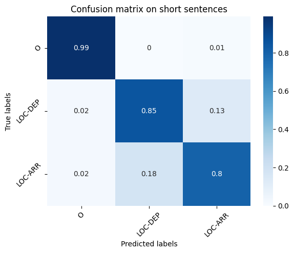

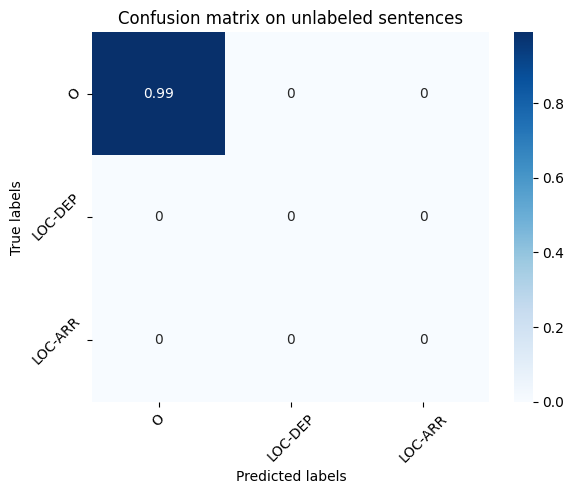

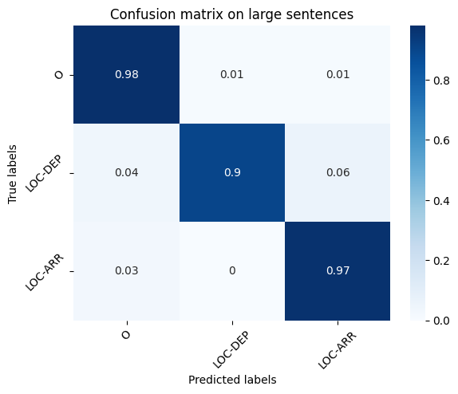

The limitation of a simple LSTM is that the inputs are treated **sequentially**. Which means that it does not benefit from the context of the words that comes after, only what comes before. Therefore, we will try the **BiLSTM model** hoping that treating the sentence from both sides will leverage more context.

#### 4.3 - BiLSTM

##### 4.3.1 - Overview

_The code for the BiLSTM model can be found in `deepl_ner.ipynb`_

Bidirectional LSTMs are a type of LSTM that are able to learn long-term dependencies in both directions.

Just like we did with the LSTM model, we tested combining the embeddings with the POS tags as features which was tested in Hoesen and Purwarianti (2020)[[5]](#5) for Indonesian NER and showed positive results.

However, as previously mentioned we were not able to include the CRF layer because of time constraints. Which should be the reason why we didn't come to the same conclusion as the authors. Hence, the model that performed the best was without the POS.

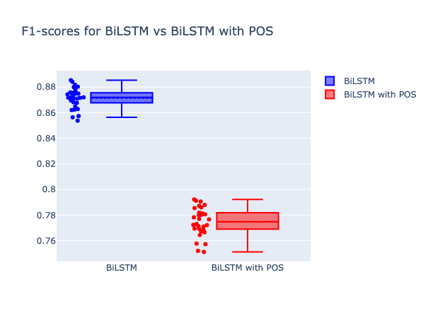

##### 4.3.2 - Architecture

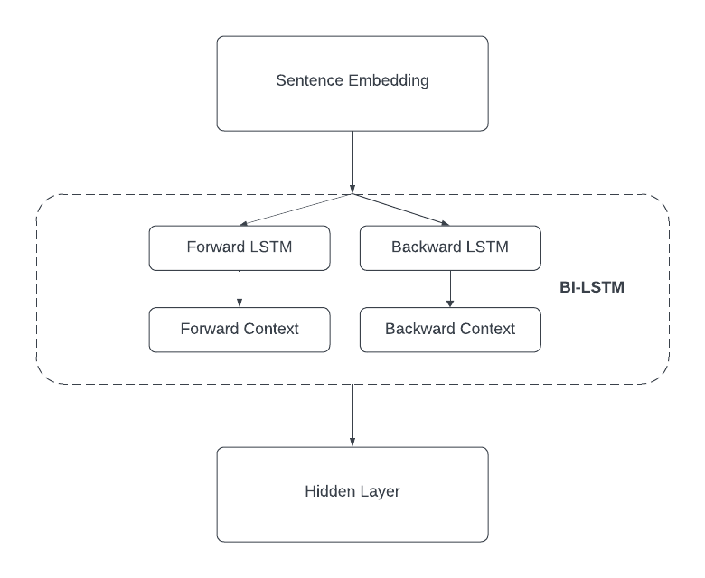

```python
bilstm = tf.keras.models.Sequential(
    layers=[
        tf.keras.layers.Embedding(len(vocab) + 1, MAX_LEN, mask_zero=True),
        tf.keras.layers.Bidirectional(
            tf.keras.layers.LSTM(MAX_LEN, return_sequences=True)
        ),
        tf.keras.layers.Dropout(0.3),
        tf.keras.layers.Dense(len(unique_labels), activation=tf.nn.log_softmax),
    ]
)
```

##### 4.3.3 - Training

```python
bilstm.compile(
    optimizer=tf.keras.optimizers.Adam(0.01),
    loss=masked_loss,
    metrics=[masked_accuracy],
)

bilstm.fit(
    train_dataset.batch(64),
    validation_data=test_dataset.batch(64),
    epochs=10,
    shuffle=True,
    callbacks=[
        tf.keras.callbacks.EarlyStopping(
            monitor="val_loss", min_delta=0.01, restore_best_weights=True
        )
    ],
)
```

Training was stopped after 2 epochs with :

- `val_masked_accuracy` : 0.9998
- `val_loss` : 6.5582e-04

##### 4.3.4 - Results

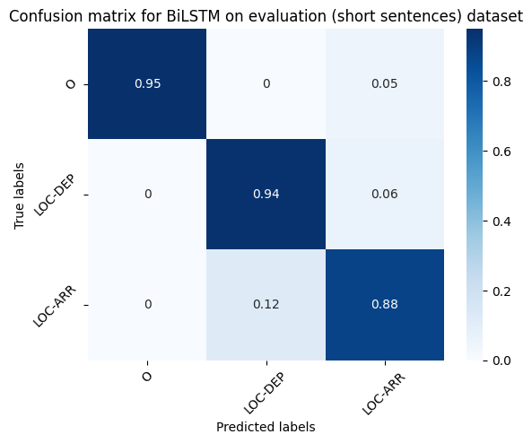


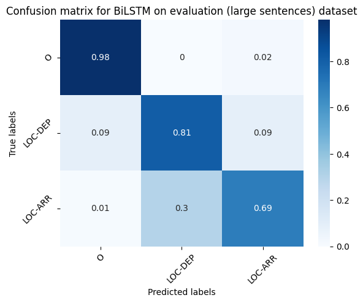

#### 4.4 - CamemBERT

##### 4.4.1 - Overview

_The code for the CamemBERT model can be found in `camemBERT_finetuning.ipynb`_

CamemBERT[[6]](#6) is a pre-trained model that is based on the BERT[[7]](#7) architecture. It is trained on the French language and is able to perform well on many NLP tasks.

We used the [`distilcamembert-base`](https://huggingface.co/cmarkea/distilcamembert-base) model because it converges faster than the `camembert-base` model. After fine-tuning the model was uploaded to Huggingace's model hub and can be found [here](https://huggingface.co/Az-r-ow/CamemBERT-NER-Travel).

##### 4.4.2 - Training

```python
camembert.compile(
    optimizer=tf.keras.optimizers.legacy.Adam(8e-4),
    loss=tf.keras.losses.SparseCategoricalCrossentropy(from_logits=True),
    metrics=[entity_accuracy],
)

early_stopping = tf.keras.callbacks.EarlyStopping(
    monitor="val_loss", min_delta=0.001, patience=0, restore_best_weights=True
)

csv_logger = tf.keras.callbacks.CSVLogger("training.log")

camembert.fit(
    train_dataset,
    validation_data=test_dataset,
    epochs=10,
    callbacks=[early_stopping, csv_logger],
)
```

##### 4.4.3 - Results

The best results so far out of all the previously seen models. This was to be expected because of the power of the BERT architecture.


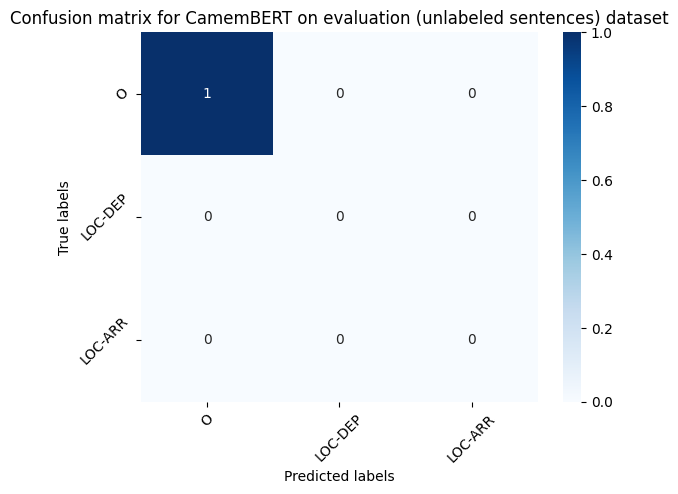

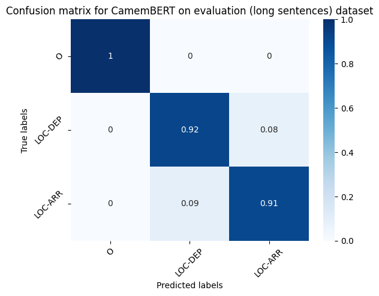

### 5 - Overall Results

Here's the bootsrapped F1-score comparison between the models :

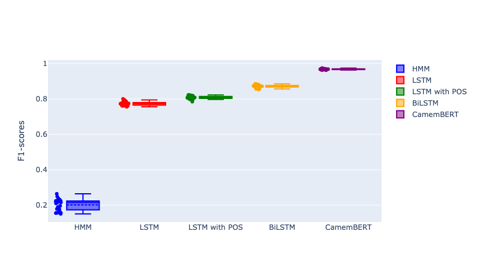

## Shortest Path Algorithm

### 1 - Djikstra's Algorithm

In this project, Dijkstra's algorithm was employed to calculate the shortest path between the train stations corresponding to the departure and arrival cities extracted from French sentences. Once the Named Entity Recognition (NER) system identified the entities representing these cities, Dijkstra's algorithm efficiently explored the graph of train stations, identifying the path with the lowest cumulative weight (e.g., travel distance or time). Its systematic exploration of nodes ensures an accurate result, making it an ideal choice for handling the non-negative weights typical of transportation networks.

### 2 - A\* Algorithm

The A* search algorithm was used as an alternative method for finding the shortest path between the departure and arrival train stations extracted by the NER system. By combining actual travel costs with heuristic estimates (e.g., geographical distance between stations), A* prioritized promising routes, significantly improving efficiency in identifying the optimal path. This heuristic-driven approach was particularly useful for reducing computational overhead while maintaining accurate results in the context of a large network of train stations in France.

## Interface

The interface was built using the [`gradio`](https://www.gradio.app/) library. It provided us with a framework that allowed us to easily integrate the different part of the project with their interactive widgets.

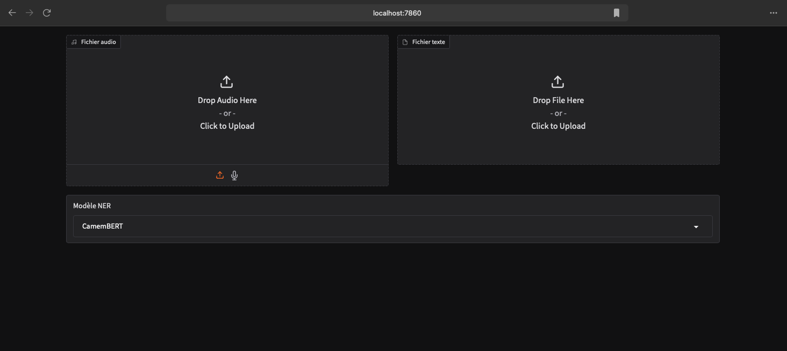

It is composed of three main components :

- **Audio Input** : Users can record their voice or upload a file which will be transcribed to text.
- **Text Input** : Users can input a text file directly into the interface. The text file can contain multiple sentences which will be processed one by one.
- **Model** : The use can select the model to use for the NER task. The models are the ones we trained in the previous section.

In the following example, we will be uploading a text file and selecting the `LSTM` model. The file will contain these example :

```
J'ai passé un bon moment à Brest c'est l'heure de prendre le train vers Paris.
Je suis à Paris. Je veux prendre le train à Montpellier.
Je veux prendre le train de Lyon à Marseille.
```

The interface will then process the text and extract the entities. The extracted entities will be used to find the shortest path between the departure and arrival cities.

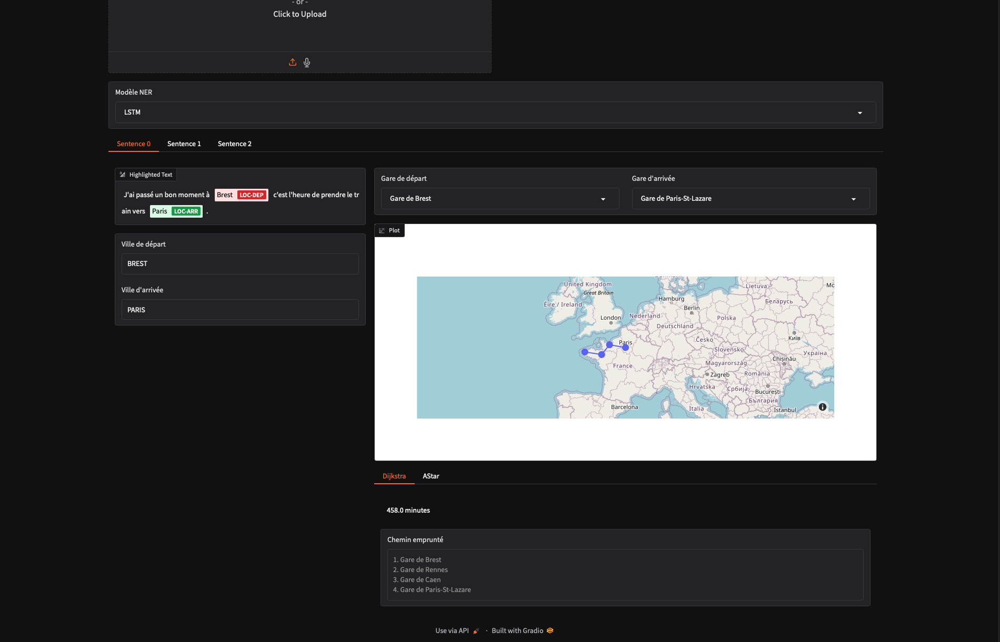

Each sentence will have it's own interactive tab. The user can then select the departure and arrival cities and the interface will display the shortest path between them on the map as well as underneath.

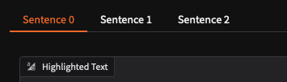

## Conclusion

In this project, we were able to learn a lot about NLP, not only about the current state of the art model architectures but also the evolution of the field. We were able to experiment with different models and see how they perform on a real-world task. We also learned about pre-processing and how it can affect the performance of the models. In addition, we found innovative ways to solve some of the problems we had, notable the data generation and labeling. Finally, we were able to integrate all the parts of the project into an intuitive interface that can be used by anyone.

## Future Work

In the future, we would like to experiment LSTM's and BiLSTM's with the CRF layer to see how much effect it will have. We could also try letter based embeddings instead of word based or combine the two alongside other feature like POS tags, capital letter positions, etc.

## References

<a id="1">[1]</a> [Whisper's github](https://github.com/openai/whisper)

<a id="2">[2]</a> Lafferty, J., McCallum, A., & Pereira, F. C. (2001). [Conditional random fields: Probabilistic models for segmenting and labeling sequence data](http://www.aladdin.cs.cmu.edu/papers/pdfs/y2001/crf.pdf).

<a id="3">[3]</a> Hochreiter, S., & Schmidhuber, J. (1997). [Long short-term memory](https://www.bioinf.jku.at/publications/older/2604.pdf).

<a id="4">[4]</a> Simeonova, S., et al. (2019). [A Morpho-Syntactically Informed LSTM-CRF Model for Named Entity Recognition](https://arxiv.org/pdf/1908.10261)

<a id="5">[5]</a> Hoesen, D. & Purwarianti, A. (2020). [Investigating Bi-LSTM and CRF with POS Tag Embedding for Indonesian Named Entity Tagger](https://arxiv.org/pdf/2009.05687)

<a id="6">[6]</a> Devlin, J. et al. (2018). [BERT: Pre-training of Deep Bidirectional Transformers for Language Understanding](https://arxiv.org/pdf/1810.04805)

<a id="7">[7]</a> Martin, L. et al. (2020). [CamemBERT: a Tasty French Language Model](https://arxiv.org/pdf/1911.03894)

<script type="text/javascript" src="http://cdn.mathjax.org/mathjax/latest/MathJax.js?config=TeX-AMS-MML_HTMLorMML"></script>
<script type="text/x-mathjax-config">
    MathJax.Hub.Config({ tex2jax: {inlineMath: [['$', '$']]}, messageStyle: "none" });
</script>
